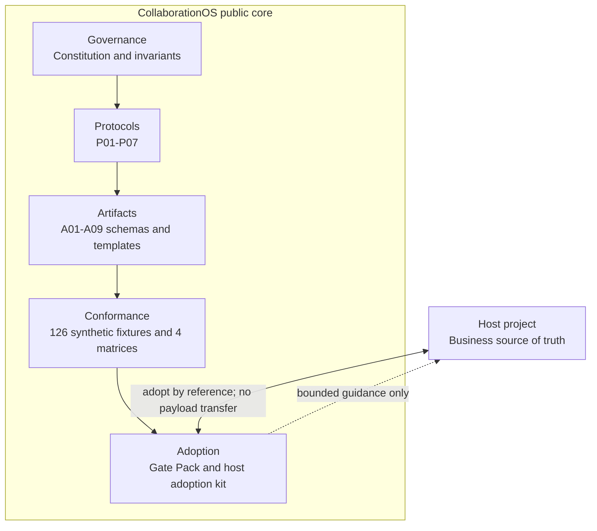
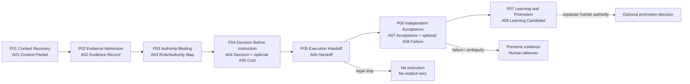

# CollaborationOS

**English** | [简体中文](README.zh-CN.md)

<p>
  <a href="https://github.com/nickzhuchen66/collaborationos/releases"></a>
  <a href="LICENSE"></a>
  <a href="docs/gate-pack-v0.1/README.md"></a>
  <a href="https://github.com/nickzhuchen66/collaborationos/discussions"></a>
</p>

**CollaborationOS (COS)** is an open governance framework for consequential
human-AI collaboration. It gives teams a disciplined way to recover context,
admit evidence, bind authority, make decisions, control execution, review
outcomes independently, preserve failure truth, and learn without handing final
accountability to an AI system.

<p>
  <a href="#architecture"><strong>Explore the architecture</strong></a>
  ·
  <a href="#quick-start">Quick start</a>
  ·
  <a href="docs/adoption-kit-v0.1/COS_NEW_HOST_PROJECT_ADOPTION_MANUAL_v0.1.md">Adoption manual</a>
  ·
  <a href="ROADMAP.md">Roadmap</a>
  ·
  <a href="CONTRIBUTING.md">Contribute</a>
</p>

> COS v0.1.0 is a **manual/static governance baseline**. It is not an agent
> runtime, automated policy engine, production authority, or completed
> cross-host validation claim.

## Why CollaborationOS Exists

AI can produce plans, code, analysis, and operational instructions faster than
most teams can inspect the authority and evidence behind them. The dangerous
gap is rarely generation alone. It is the loss of provenance between a request
and the consequential action that follows.

COS makes that provenance inspectable:

| Common failure mode | COS response |
|---|---|
| Context is inferred from an old thread or partial brief | Recover and accept a bounded context packet before downstream work |
| Submitted material is treated as accepted evidence | Separate evidence submission, admission, grounding, and exclusion |
| Participation is mistaken for authority | Bind functional roles and current authority explicitly |
| An AI-generated proposal silently becomes an instruction | Require a human-owned decision before executable handoff |
| Technical completion is reported as acceptance | Keep execution evidence separate from independent acceptance |
| Failure history is cleaned up or retried automatically | Preserve failure truth, require explicit takeover, and prohibit implicit retry |
| A local lesson silently changes the shared framework | Route learning through a bounded candidate and separate promotion authority |

## Architecture

COS separates a stable governance core from every adopting project's business
system. The host keeps its source of truth, domain data, permissions, execution
systems, and final decisions. COS supplies protocols, artifact contracts,
conformance examples, and adoption guidance.



### The seven-protocol governance loop



Every transition checks current upstream evidence and authority. A filename,
actor identity, successful tool call, or later result cannot create authority
retroactively.

## What Ships in v0.1.0

- **7 governance protocols**, P01-P07;
- **9 strict JSON schemas** and matching human-readable templates, A01-A09;
- **126 synthetic conformance fixtures** across context, authority, evidence,
  decision, cost, execution, acceptance, failure, and learning;
- **4 manual conformance matrices**;
- a **Manual/Static Gate Pack** for operators;
- a **new-host adoption manual** and host-side templates;
- a synthetic end-to-end walkthrough;
- Apache-2.0 licensing and public contribution policies.

## Quick Start

### 1. Understand the invariants

Read the [Constitution](00_Governance/COS_Constitution.md), then the
[Methodology](01_Core/COS_Methodology.md) and
[Target Architecture](01_Core/COS_Target_Architecture.md).

### 2. Follow the protocol order

Use the [Protocol System Map](02_Protocols/COS_Protocol_System_Map_v0.1.md)
to move through P01-P07 without collapsing context, evidence, authority,
decision, execution, and acceptance into one record.

### 3. Select only the artifacts you need

Use the
[Gate Pack Artifact Register](03_Schemas_and_Templates/COS_Gate_Pack_Artifact_Register_v0.1.md)
and [Artifact Selection and Ownership](docs/gate-pack-v0.1/ARTIFACT_SELECTION_AND_OWNERSHIP.md).
Optional does not mean implicit: triggered artifacts must still be explicit.

### 4. Operate the manual gate

Follow the [Manual Operator Flow](docs/gate-pack-v0.1/MANUAL_OPERATOR_FLOW.md)
and validate the relevant fixtures against the
[Manual Conformance Guide](docs/gate-pack-v0.1/MANUAL_CONFORMANCE_GUIDE.md).

### 5. Start with a synthetic case

Walk through [Northstar Docs](examples/synthetic/README.md), including its
positive, legal-stop, and failure/takeover branches. Do not begin with private
host evidence.

### 6. Adopt COS into a host project by reference

Follow the
[New Host Project Adoption Manual](docs/adoption-kit-v0.1/COS_NEW_HOST_PROJECT_ADOPTION_MANUAL_v0.1.md).
Pin a COS version, map roles and artifacts, declare permissions, and keep the
host's source of truth outside COS.

## Choose Your Entry Point

| You are... | Start with... | Outcome |
|---|---|---|
| Evaluating COS | [Methodology](01_Core/COS_Methodology.md) | Understand the operating model and claim boundary |
| Designing a governed AI workflow | [Protocol System Map](02_Protocols/COS_Protocol_System_Map_v0.1.md) | Map the required P01-P07 stages |
| Preparing a consequential change | [Manual Operator Flow](docs/gate-pack-v0.1/MANUAL_OPERATOR_FLOW.md) | Assemble a bounded manual Gate Pack |
| Integrating a new project | [Host Adoption Manual](docs/adoption-kit-v0.1/COS_NEW_HOST_PROJECT_ADOPTION_MANUAL_v0.1.md) | Adopt COS without importing host payloads |
| Reviewing a schema or protocol | [Conformance Guide](docs/gate-pack-v0.1/MANUAL_CONFORMANCE_GUIDE.md) | Test positive, legal-stop, and failure cases |
| Contributing publicly | [Contributing Guide](CONTRIBUTING.md) | Propose a synthetic, reviewable change |

## Core Rules

1. Human final authority is explicit and cannot be inferred from participation.
2. Evidence admission is separate from evidence submission.
3. Decision precedes executable instruction.
4. Permissions default to false and are scoped to a specific action.
5. Execution success is separate from independent acceptance.
6. Failure evidence is preserved; retry is never implicit.
7. Learning candidates do not automatically modify the COS core.
8. A host project retains its own business source of truth.

## Repository Map

```text
.
├── 00_Governance/              # Public Constitution
├── 01_Core/                    # Methodology and target architecture
├── 02_Protocols/               # P01-P07 and protocol dependency map
├── 03_Schemas_and_Templates/   # A01-A09 schemas and human templates
├── 05_Conformance/             # Manual matrices and 126 fixtures
├── docs/
│   ├── gate-pack-v0.1/         # Operator-facing manual/static Gate Pack
│   └── adoption-kit-v0.1/      # New-host adoption guide and templates
├── examples/synthetic/         # Fictional walkthrough; no host payload
└── .github/                    # Contribution and issue workflows
```

The non-self [package manifest](PACKAGE_MANIFEST.json) binds every other tracked
file on the current branch by path, byte count, and SHA-256 digest.

## Project Status and Boundaries

The stable public release is `v0.1.0`. Work on `main` improves public usability
and repository quality without widening the v0.1.0 capability claim.

COS currently does **not** ship:

- an automated validator, CLI, SDK, SaaS product, or agent framework;
- executable Skills or Workflows;
- a host connector or authority to access another repository;
- production execution authority;
- completed cross-host validation.

See the [Roadmap](ROADMAP.md) for the public development direction. Historical
experiments and internal governance records are intentionally outside this
repository.

## Community

Contributions are welcome when they improve clarity, safety boundaries,
schemas, templates, synthetic fixtures, conformance coverage, or adoption
guidance.

- Read [CONTRIBUTING.md](CONTRIBUTING.md) and the
  [Code of Conduct](CODE_OF_CONDUCT.md).
- Use [GitHub Discussions](https://github.com/nickzhuchen66/collaborationos/discussions)
  for design questions and adoption conversations.
- Use [Issues](https://github.com/nickzhuchen66/collaborationos/issues) for
  bounded defects, documentation gaps, and proposals.
- Report sensitive problems through the process in [SECURITY.md](SECURITY.md).

If COS helps your team make human-AI work more inspectable, starring the
repository helps other builders discover it.

## License and Citation

CollaborationOS is available under the [Apache License 2.0](LICENSE). See
[NOTICE](NOTICE) for attribution and [CITATION.cff](CITATION.cff) for citation
metadata.

The license does not grant a right to imply endorsement by the upstream
CollaborationOS project. `CollaborationOS` is used here as the project name; no
registered trademark claim is made.
