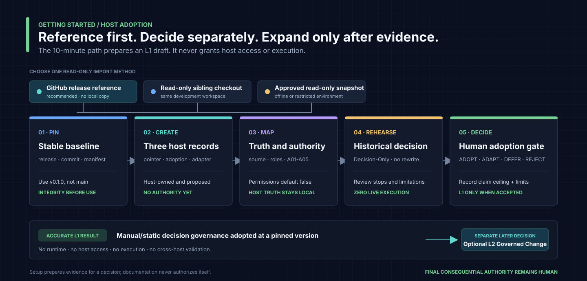
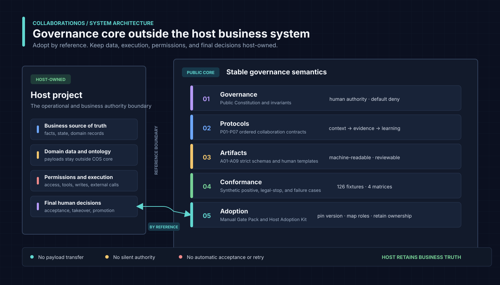
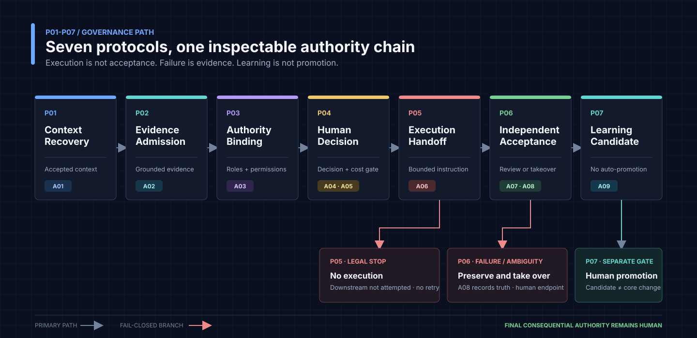

# CollaborationOS

[English](README.md) | **简体中文**

<p>
  <a href="https://github.com/nickzhuchen66/collaborationos/releases"></a>
  <a href="LICENSE"></a>
  <a href="https://github.com/nickzhuchen66/collaborationos/actions/workflows/validate.yml"></a>
  <a href="docs/gate-pack-v0.1/README.md"></a>
  <a href="https://github.com/nickzhuchen66/collaborationos/discussions"></a>
</p>

**CollaborationOS（COS）** 是面向重要人类-AI协作的开源治理框架。它帮助团队恢复上下文、准入证据、绑定权限、形成决策、控制执行、独立验收、保留失败事实并沉淀学习，同时不把最终责任转交给 AI。

<p>
  <a href="#10-分钟接入-cos"><strong>开始接入</strong></a>
  ·
  <a href="#架构">了解架构</a>
  ·
  <a href="#在-ai-agent-中使用-cos">Agent Toolkit</a>
  ·
  <a href="docs/adoption-kit-v0.1/COS_NEW_HOST_PROJECT_ADOPTION_MANUAL_v0.1.md">接入手册</a>
  ·
  <a href="ROADMAP.md">路线图</a>
  ·
  <a href="CONTRIBUTING.md">参与贡献</a>
</p>

> COS v0.1.0 是一个**人工/静态治理基线**。它不是 Agent runtime、自动策略引擎、生产权限系统，也不声称已经完成跨 Host 验证。

## 10 分钟接入 COS

COS 不需要作为 runtime 安装。新项目通过引用固定版本、创建三个 Host 自有治理文件，并把草案提交给人类决策所有者来完成初始准备。



| 步骤 | 操作 | 公开指南 |
|---|---|---|
| 1. 导入 | 选择 GitHub Release 引用、只读 sibling checkout 或受控 snapshot | [Import Guide](docs/getting-started/IMPORT_GUIDE.md) |
| 2. 准备 | 创建 L1 Entry Pointer、Adoption Record 和 Host Adapter | [10-Minute L1 Setup](docs/getting-started/10_MINUTE_QUICKSTART.md) |
| 3. 检查 | 检查版本、权限、角色、rehearsal 与 stop conditions | [Host Adoption Checklist](docs/getting-started/HOST_ADOPTION_CHECKLIST.md) |
| 4. 决策 | 完成正式手册，由人类作出最终采用处置 | [完整 Adoption Manual](docs/adoption-kit-v0.1/COS_NEW_HOST_PROJECT_ADOPTION_MANUAL_v0.1.md) |
| 5. 使用 | 在 L1 跑一次 Decision-Only；只有独立决策后才能进入 L2 | [Manual Operator Flow](docs/gate-pack-v0.1/MANUAL_OPERATOR_FLOW.md) |

希望直接复制文件时，从[合成 Starter Host](examples/starter-host/README.md)开始。10 分钟路径只会准备好 `L1` 草案，不授权 Host access、执行、成本、重试、验收、晋升、runtime 或 production。

## 在 AI Agent 中使用 COS

公开 Wave 1 Toolkit 把四项有边界的 COS 能力封装为 Codex-compatible
Skills，并提供一个零第三方依赖的 Decision-Only Workflow helper。

| 能力 | 公开入口 | 能做什么 |
|---|---|---|
| Context Recovery | [`cos-context-recovery`](skills/cos-context-recovery/SKILL.md) | 准备或检查 A01 草案 |
| Role and Authority Binding | [`cos-role-authority-binding`](skills/cos-role-authority-binding/SKILL.md) | 准备或检查 A03 权限图 |
| Decision Packet Preparation | [`cos-decision-packet-preparation`](skills/cos-decision-packet-preparation/SKILL.md) | 准备或检查 A04 决策包 |
| Review Circuit Breaker | [`cos-review-circuit-breaker`](skills/cos-review-circuit-breaker/SKILL.md) | 分类 review 状态并给出停止路由建议 |
| Decision-Only Workflow | [`COS-WF02`](workflows/decision-only/WORKFLOW.md) | 验证已接受 A01-A04 的关系，并停在 P05 之前 |

本地安装：

```bash
for skill in \
  cos-context-recovery \
  cos-role-authority-binding \
  cos-decision-packet-preparation \
  cos-review-circuit-breaker
do
  target="$HOME/.codex/skills/$skill"
  test ! -e "$target" || { echo "Refusing to overwrite: $target" >&2; exit 1; }
  cp -R "skills/$skill" "$target"
done
```

重新开启一个 Codex 任务后即可按 Skill 名称调用。使用前验证公开绑定与测试：

```bash
python3 tools/cos_wave1.py verify-bindings --cos-root .
python3 -m unittest discover -s tests -p "test_*.py" -v
```

Toolkit 状态为**公开实验性、无执行能力**。输出只是
`authority_effect=none` 的草案或观察结果，不能自我验收、授权 Host
访问、启动实现或推进治理状态。详见 [Skills 指南](skills/README.md)和
[Workflow 指南](workflows/README.md)。

## 为什么需要 CollaborationOS

AI 生成计划、代码、分析和操作指令的速度，已经快于多数团队检查其证据和权限的速度。真正危险的通常不只是生成错误，而是请求到执行之间的来源、权限和责任链条消失了。

COS 让这条链路可检查：

| 常见失控方式 | COS 的处理方式 |
|---|---|
| 从旧对话或不完整简报推断上下文 | 在后续工作前恢复并接受有边界的上下文包 |
| 把提交材料直接当成已接受证据 | 分离提交、准入、grounding 和排除 |
| 把参与者身份误当作权限 | 显式绑定功能角色和当前权限 |
| AI 建议悄悄变成执行指令 | 执行交接前必须有由人类负责的决策 |
| 把技术完成当作验收通过 | 分离执行证据与独立验收 |
| 清理失败现场或自动重试 | 保留失败事实，显式接管，禁止隐式重试 |
| 局部经验自动改写共享框架 | 学习候选必须经过独立的晋升权限 |

## 架构

COS 把稳定的治理核心与每个接入项目的业务系统分开。Host 项目继续拥有业务真相源、领域数据、权限、执行系统和最终决策；COS 提供协议、工件合同、Conformance 样例和接入指南。



### 七协议治理闭环



每个阶段都检查当前上游证据和权限。文件名、参与者身份、工具调用成功或后续结果，都不能反向创造权限。

## v0.1.0 包含什么

- P01-P07 **7 个治理协议**；
- A01-A09 **9 个严格 JSON Schema** 与对应的人类可读模板；
- 覆盖上下文、权限、证据、决策、成本、执行、验收、失败和学习的 **126 个合成 Fixture**；
- **4 个人工 Conformance Matrix**；
- 面向操作者的 **Manual/Static Gate Pack**；
- **新 Host 接入手册**和 Host 侧模板；
- 一个合成端到端案例；
- Apache-2.0 许可证与公开协作规则。

尚未发布的 `main` 分支还包含公开实验性 Wave 1 Skills 与 Decision-Only
helper；它们不扩大稳定版 v0.1.0 的能力声明。

## 深入了解完整框架

1. 阅读[宪法](00_Governance/COS_Constitution.md)、[方法论](01_Core/COS_Methodology.md)和[目标架构](01_Core/COS_Target_Architecture.md)。
2. 根据[协议系统图](02_Protocols/COS_Protocol_System_Map_v0.1.md)依次执行 P01-P07。
3. 使用[工件注册表](03_Schemas_and_Templates/COS_Gate_Pack_Artifact_Register_v0.1.md)选择必要的 A01-A09 工件。
4. 按照[人工操作流程](docs/gate-pack-v0.1/MANUAL_OPERATOR_FLOW.md)和[Conformance 指南](docs/gate-pack-v0.1/MANUAL_CONFORMANCE_GUIDE.md)完成检查。
5. 先走一遍虚构的 [Northstar Docs](examples/synthetic/README.md) 正例、legal-stop 和 failure/takeover 分支。
6. 新项目通过[Host Adoption Manual](docs/adoption-kit-v0.1/COS_NEW_HOST_PROJECT_ADOPTION_MANUAL_v0.1.md)按版本引用 COS，不把 Host payload 复制进 COS。

## 根据你的角色选择入口

| 你的目标 | 推荐入口 | 结果 |
|---|---|---|
| 为新项目接入 COS | [Getting Started](docs/getting-started/README.md) | 准备并审查固定版本的 L1 Host Adoption |
| 评估 COS | [方法论](01_Core/COS_Methodology.md) | 理解运行模型与能力边界 |
| 设计受治理的 AI 流程 | [协议系统图](02_Protocols/COS_Protocol_System_Map_v0.1.md) | 映射 P01-P07 阶段 |
| 准备重要变更 | [人工操作流程](docs/gate-pack-v0.1/MANUAL_OPERATOR_FLOW.md) | 组装有边界的人工 Gate Pack |
| 在 AI coding agent 中使用 COS | [公开 Skills](skills/README.md) | 安装无执行权限的准备型 Skills |
| 为新项目接入 COS | [Host Adoption Manual](docs/adoption-kit-v0.1/COS_NEW_HOST_PROJECT_ADOPTION_MANUAL_v0.1.md) | 保留 Host 业务主权的引用式接入 |
| 检查协议或 Schema | [Conformance 指南](docs/gate-pack-v0.1/MANUAL_CONFORMANCE_GUIDE.md) | 覆盖正例、legal-stop 与失败分支 |
| 公开贡献 | [贡献指南](CONTRIBUTING.md) | 提交合成、可审查的改进 |

## 核心规则

1. 人类最终权限必须显式声明，不能从参与关系推断。
2. 证据提交与证据准入分离。
3. 决策先于可执行指令。
4. 权限默认 false，并绑定到具体行动。
5. 执行成功与独立验收分离。
6. 失败证据必须保留，重试不能隐式发生。
7. 学习候选不会自动修改 COS Core。
8. Host 项目保留自己的业务真相源。

## 仓库结构

```text
.
├── 00_Governance/              # 公开宪法
├── 01_Core/                    # 方法论与目标架构
├── 02_Protocols/               # P01-P07 与依赖关系
├── 03_Schemas_and_Templates/   # A01-A09 Schema 与模板
├── 05_Conformance/             # 4 个 Matrix 与 126 个 Fixture
├── skills/                     # 公开 Wave 1 Codex-compatible Skills
├── workflows/                  # Decision-Only Workflow 合同与 Schema
├── tools/                      # 零第三方依赖的本地验证 helper
├── tests/                      # 公开 Toolkit 回归测试
├── docs/
│   ├── getting-started/         # 导入、10 分钟 L1 准备与检查清单
│   ├── gate-pack-v0.1/         # 面向操作者的 Manual/Static Gate Pack
│   └── adoption-kit-v0.1/      # 新 Host 接入指南与模板
├── examples/
│   ├── starter-host/            # 可复制修改的合成 L1 脚手架
│   └── synthetic/               # 虚构案例，不包含 Host payload
└── .github/                    # 公开协作入口
```

非自指的[包清单](PACKAGE_MANIFEST.json)用路径、字节数和 SHA-256 绑定当前分支的其他所有 tracked 文件。

## 项目状态与边界

稳定公开版本为 `v0.1.0`。`main` 上的工作优先改善公开可用性和仓库质量，不扩大 v0.1.0 的能力声明。

`main` 现在包含小型实验性本地 validator 和四个 Agent Skills。COS
仍**不包含**生产策略引擎、SDK、SaaS、自主 Agent framework、具有执行
权限的 Workflow、Host connector 或生产执行权限，也不声称完成跨 Host
验证。详见[公开路线图](ROADMAP.md)。历史实验、内部治理记录和 Host
evidence 不会进入本公开仓库。

## 社区

- 提交前阅读[贡献指南](CONTRIBUTING.md)和[行为准则](CODE_OF_CONDUCT.md)。
- 在 [GitHub Discussions](https://github.com/nickzhuchen66/collaborationos/discussions) 讨论设计和接入问题。
- 在 [Issues](https://github.com/nickzhuchen66/collaborationos/issues) 提交有边界的问题、文档缺口和建议。
- 每个 Pull Request 都会运行 strict JSON、source binding、Toolkit
  tests、本地链接、private path 和 package manifest 检查。
- 敏感问题按照[安全政策](SECURITY.md)报告。

如果 COS 对你的人类-AI协作有帮助，Star 可以帮助更多开发者发现它。

## 许可证与引用

CollaborationOS 采用 [Apache License 2.0](LICENSE)。归属说明见 [NOTICE](NOTICE)，引用信息见 [CITATION.cff](CITATION.cff)。
